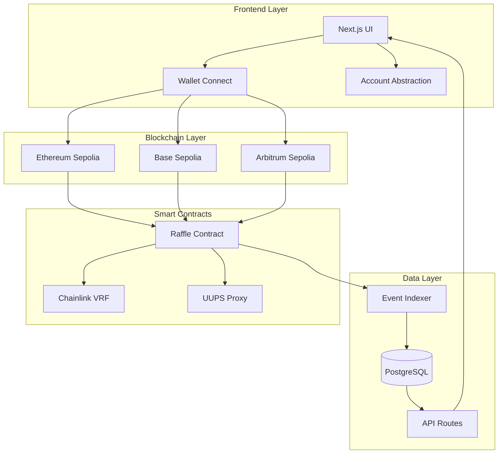

# 🎲 Raffle DApp - Cross-Chain Lottery System

<div align="center">


**透明性と公平性を保証するブロックチェーンベースの抽選システム**

[](your-vercel-url)
[](https://sepolia.etherscan.io)
[](https://base-sepolia.blockscout.com)
[](https://sepolia.arbiscan.io)

</div>

## 📱 ライブデモ

- **フロントエンド**: [https://your-app.vercel.app](https://your-app.vercel.app)
- **対応チェーン**: Ethereum Sepolia, Base Sepolia, Arbitrum Sepolia
- **テスト用USDC**: 各テストネットで無料取得可能

## ✨ 主要機能

### 🔥 コア機能
- **完全分散型抽選**: スマートコントラクトによる透明な抽選プロセス
- **VRF証明可能ランダム性**: Chainlink VRFによる改ざん不可能な乱数生成
- **クロスチェーン対応**: 複数ブロックチェーン間での統一された体験
- **ガス代無料参加**: Account Abstractionによるユーザビリティ向上

### 💰 経済システム
- **ジャックポットシステム**: 蓄積型大賞システム
- **自動賞金分配**: スマートコントラクトによる即座の支払い
- **USDC決済**: 安定した価値での参加とペイアウト
- **手数料透明性**: 全ての手数料がオンチェーンで確認可能

### 🚀 技術的特徴
- **UUPS Proxy Pattern**: アップグレード可能なコントラクト設計
- **リアルタイム同期**: イベントベースの即時状態更新
- **モバイル最適化**: レスポンシブデザインとタッチ操作対応
- **ソーシャルログイン**: Google, Xアカウントでの簡単参加

## 🏗️ システムアーキテクチャ



## 🚀 クイックスタート

### 前提条件

#### 🐳 Docker使用の場合（推奨）
- Docker & Docker Compose
- Git

#### 📦 ローカル開発の場合
- Node.js 22.x以上
- [Foundry](https://book.getfoundry.sh/getting-started/installation)
- MetaMaskまたは対応ウォレット

### ローカル開発環境

#### 🐳 Docker使用（推奨）

```bash
# リポジトリのクローン
git clone https://github.com/your-username/raffle-dapp.git
cd raffle-dapp

# 全サービス起動（フロントエンド + バックエンド）
docker-compose up

# バックグラウンド起動
docker-compose up -d

# インデクサー含む起動
docker-compose --profile indexer up

# 特定のサービスのみ起動
docker-compose up frontend
docker-compose up backend

# ログ確認
docker-compose logs frontend
docker-compose logs backend

# コンテナに入る
docker-compose exec frontend sh
docker-compose exec backend bash

# サービス停止
docker-compose down
```

アクセス:
- **フロントエンド**: http://localhost:3000
- **Anvil（ローカルチェーン）**: http://localhost:8545

#### 📦 ローカルインストール

```bash
# リポジトリのクローン
git clone https://github.com/your-username/raffle-dapp.git
cd raffle-dapp

# 全依存関係のインストール
npm install

# フロントエンド開発サーバー起動
cd frontend
npm run dev
# http://localhost:3000 でアクセス

# バックエンド（別ターミナル）
cd backend
make install && make build
forge test
```

### 環境変数設定

```bash
# frontend/.env.local
NEXT_PUBLIC_ALCHEMY_API_KEY=your_alchemy_api_key
NEXT_PUBLIC_WALLETCONNECT_PROJECT_ID=your_walletconnect_project_id

# backend/.env
PRIVATE_KEY=your_private_key
SEPOLIA_RPC_URL=your_sepolia_rpc_url
BASE_SEPOLIA_RPC_URL=your_base_sepolia_rpc_url
ARBITRUM_SEPOLIA_RPC_URL=your_arbitrum_sepolia_rpc_url
```

## 📁 プロジェクト構成

```
Raffle_Dapp/
├── 📂 backend/              # Foundry + Solidity スマートコントラクト
│   ├── src/                 # コントラクトソースコード
│   ├── test/                # テストファイル
│   ├── script/              # デプロイメントスクリプト
│   └── README.md            # バックエンド詳細ドキュメント
├── 📂 frontend/             # Next.js + TypeScript フロントエンド
│   ├── app/                 # App Router構成
│   ├── components/          # Reactコンポーネント
│   ├── hooks/               # カスタムフック
│   └── README.md            # フロントエンド詳細ドキュメント
├── 📂 raffleIndexer/        # Rindexer イベントインデックス
│   ├── rindexer.yaml        # インデックス設定
│   ├── docker-compose.yml   # PostgreSQL設定
│   └── README.md            # インデックス詳細ドキュメント
└── 📂 scripts/              # 共通スクリプト
```

詳細な技術仕様と開発手順については、各ディレクトリのREADME.mdを参照してください。

## 🛠️ 技術スタック

### フロントエンド
- **Framework**: Next.js 15, TypeScript
- **Styling**: Tailwind CSS, shadcn/ui
- **Web3**: wagmi, viem, Account Kit
- **Deployment**: Vercel

### バックエンド
- **Smart Contracts**: Solidity, Foundry
- **VRF**: Chainlink VRF v2.5
- **Proxy**: OpenZeppelin UUPS
- **Testing**: Forge

### インフラ
- **RPC**: Alchemy
- **Indexing**: Rindexer + PostgreSQL
- **CI/CD**: GitHub Actions

## 🎯 ロードマップ

### Phase 1 ✅ 完了
- [x] 基本的なラッフルシステム
- [x] VRF統合
- [x] クロスチェーン対応
- [x] Account Abstraction

### Phase 2 🚧 進行中
- [ ] mainnet展開
- [ ] NFTベース参加券
- [ ] DAO投票システム

### Phase 3 📋 計画中
- [ ] L2最適化
- [ ] モバイルアプリ
- [ ] 追加チェーン対応

## 🤝 コントリビューション

1. このリポジトリをFork
2. Feature branchを作成 (`git checkout -b feature/amazing-feature`)
3. 変更をCommit (`git commit -m 'Add amazing feature'`)
4. Branchにpush (`git push origin feature/amazing-feature`)
5. Pull Requestを作成

## 📄 ライセンス

MIT License - 詳細は[LICENSE](LICENSE)ファイルを参照

## 🎓 学習リソース

このプロジェクトは[Cyfrin Updraft](https://updraft.cyfrin.io/)のWeb3開発コースの一環として開発されました。

### 関連チュートリアル
- [Foundry Fundamentals](https://github.com/Cyfrin/foundry-full-course-cu)
- [Advanced Foundry](https://github.com/Cyfrin/advanced-foundry-course)
- [Smart Contract Security](https://github.com/Cyfrin/security-and-auditing-full-course-s23)

---

<div align="center">

**🎲 公平で透明な抽選システムを、ブロックチェーンの力で。**

[Live Demo](https://your-app.vercel.app) • [Documentation](./docs) • [Report Bug](https://github.com/your-username/raffle-dapp/issues)

</div>